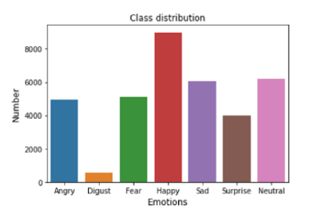
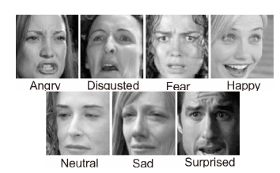
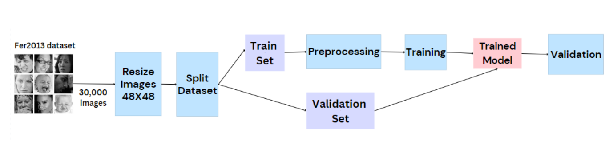
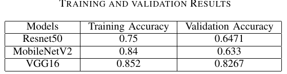
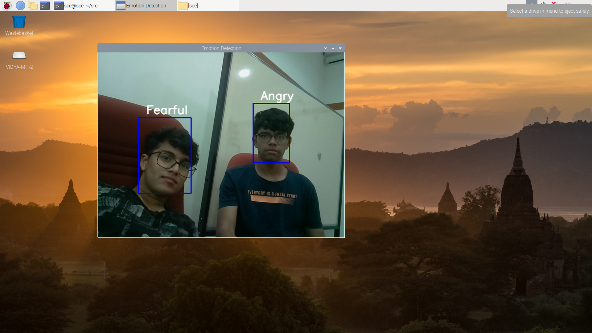

# Emotion Classification in real time
This project aims to classify emotions in real time using deep learning algorithms. This was ported to a Raspberry Pi 4, where it used less than 1 GB of RAM at any given point of time.

## Data
The project uses the FER 2013 dataset by Goodfellow et al. which contains 30,000 images with different types of images:

1) Anger
2) Disgust
3) Fear
4) Joy
5) Sadness
6) Surprise
7) Melancholy

All images are 48x48 pixels. The below chart shows the distribution of imagess

## Model training

Here, the Haar classifier was used to recognise the faces appearing in the image. Three models have been trained using transfer learning: VGG16, Resnet50 and MobileNetV2.

## Results

